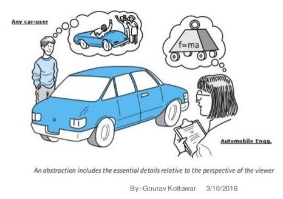
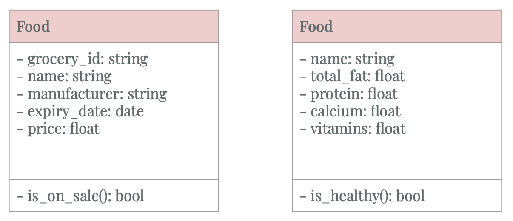
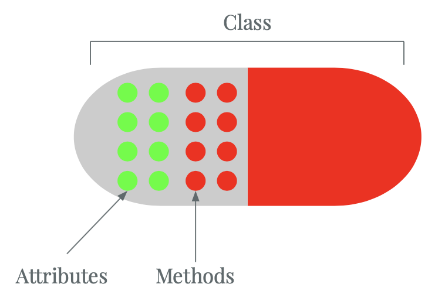
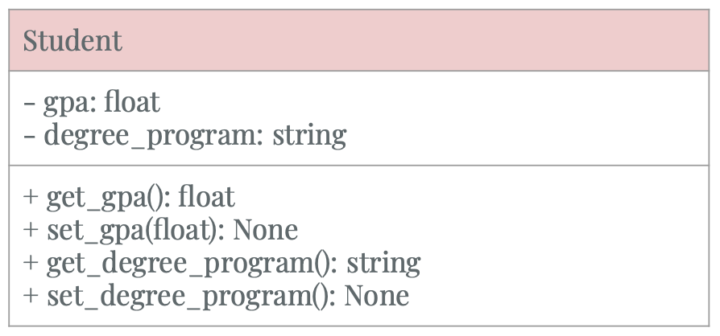
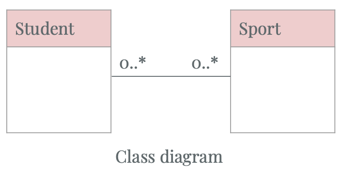

# Fundamental Design Principles in Object-oriented Programming

- [Abstraction](#Abstraction)
- [Encapsulation](#Encapsulation)
- [Decomposition](#Decomposition)
- [Generalization](#Generalization)

## Design Principles

### Abstraction
- Example of how a car object could be abstracted in different contexts
    

- Food objects in a grocery store and health context are represented differently.

    

    - In the above figure, we use UML class diagrams to represent the differences between how food objects are abstracted in 2 specific cases.
    
    - A UML class diagram consists of 3 parts:
        - The top part defines the name of the class
        - The middle part defines the attributes of the class
        - The bottom part defines the behaviors of the class 

### Encapsulation

- Encapsulation involves 3 main ideas:

    
    
    - Bundle attributes and behaviors that manipulate the attributes together into a self-contained object.
    - Expose certain attributes and behaviors to outside accesses.
    - Restrict access to certain attributes and behaviors to only within that object.

- Abstraction helps to define what attributes and behaviors are relevant in some context. Encapsulation ensures that these characteristics are bundled together in the same class.
- Benefits of encapsulation
    - Data integrity:
        - You prevent outside access to all the attributes, except through specific methods. For example, the 4-scale gpa attribute of *Student* class could not be directly changed to a value of 10.0
        - Implement *getter* and *setter* methods to provide access and update of the attributes.
    - Black box thinking: The class interface remains the same, while the internal implementation of the class could be changed.
- Encapsulation applies to a *Student* class:

    

    - In this UML class diagram, we prevent direct *get* and *set* to the Student attributes via assignments. This is represented by ```-``` in front of class attributes.
    - Public accesses to getter and setter are represented by ```+``` in front of the methods.


### Decomposition

- Decomposition involves 2 main ideas:
    - Divide the whole thing up into different smaller and manageable parts.
    - Merge a bunch of separate parts with different functionalities and combining them together to form a whole.
- 3 types of relationship in decomposition. They define the interactions between the whole and the parts.
    - Association
    - Aggregation
    - Composition
- Association
    - There is a loose relationship between two objects. These objects may interact with each other for sometime.
    - UML class diagram demonstration of *Association* relationship

        

        - The straight line between two UML objects denotes the relationship is *Association*
        - ```0..*``` this means that the Sport object is associated with 0 or more Student objects.
        - Code snippet sample
            ```python3
            class Student:
                def play(sport: Sport):
                    ...
            ```

- Aggregation

- Composition

### Generalization


## Practice
- Problem 1: Design UML diagrams representing Car and Driver class?
- Problem 2: Design a UML diagram representing the interactions between Car and Driver classes?


## References
- 