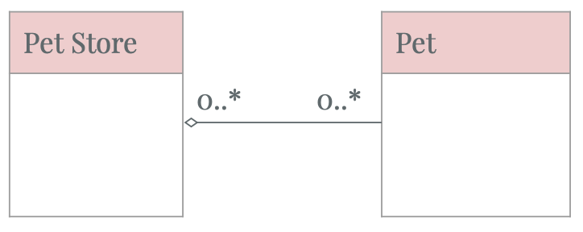
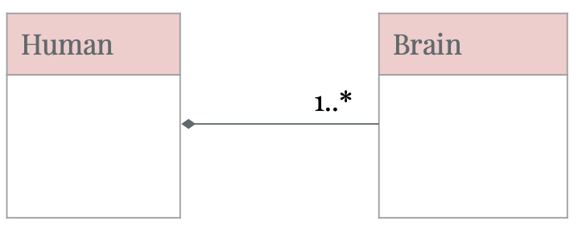
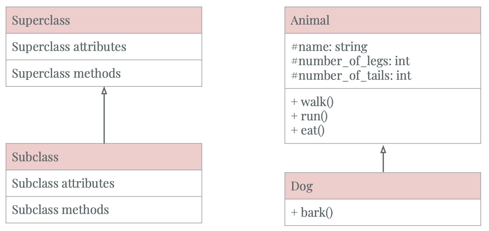

# Fundamental Design Principles in Object-oriented Programming

- [Abstraction](#Abstraction)
- [Encapsulation](#Encapsulation)
- [Decomposition](#Decomposition)
- [Generalization](#Generalization)

## Design Principles

### Abstraction
- Example of how a car object could be abstracted in different contexts
    

- Food objects in a grocery store and health context are represented differently.

    

    - In the above figure, we use UML class diagrams to represent the differences between how food objects are abstracted in 2 specific cases.
    
    - A UML class diagram consists of 3 parts:
        - The top part defines the name of the class
        - The middle part defines the attributes of the class
        - The bottom part defines the behaviors of the class 

### Encapsulation

- Encapsulation involves 3 main ideas:

    
    
    - Bundle attributes and behaviors that manipulate the attributes together into a self-contained object.
    - Expose certain attributes and behaviors to outside accesses.
    - Restrict access to certain attributes and behaviors to only within that object.

- Abstraction helps to define what attributes and behaviors are relevant in some context. Encapsulation ensures that these characteristics are bundled together in the same class.
- Benefits of encapsulation
    - Data integrity:
        - You prevent outside access to all the attributes, except through specific methods. For example, the 4-scale gpa attribute of *Student* class could not be directly changed to a value of 10.0
        - Implement *getter* and *setter* methods to provide access and update of the attributes.
    - Black box thinking: The class interface remains the same, while the internal implementation of the class could be changed.
- Encapsulation applies to a *Student* class:

    

    - In this UML class diagram, we prevent direct *get* and *set* to the Student attributes via assignments. This is represented by ```-``` in front of class attributes.
    - Public accesses to getter and setter are represented by ```+``` in front of the methods.


### Decomposition

- Decomposition involves 2 main ideas:
    - Divide the whole thing up into different smaller and manageable parts.
    - Merge a bunch of separate parts with different functionalities and combining them together to form a whole.
- 3 types of relationship in decomposition. They define the interactions between the whole and the parts.
    - Association
    - Aggregation
    - Composition
- Association
    - There is a loose relationship between two objects. These objects may interact with each other for sometime.
    - UML class diagram demonstration of *Association* relationship

        

        - The straight line between two UML objects denotes the relationship is *Association*. Two objects are completely separate entities. If one object is destroyed, the other can continue to exist. One object does not belong to another.
        - ```0..*``` this means that the Sport object is associated with 0 or more Student objects.
        - Code snippet sample
            ```python3
            class Student:
                def play(sport: Sport):
                    ...
            ```
- Aggregation
    - Aggregation is a "has-a" relationship where a whole has parts that belong to it. The "has-a" relationship from a whole to the parts is considered weak. In other words, parts can belong to the whole, but they can exist independently.
    - UML class diagram demonstration of *Aggregation* relationship

        

        - The empty diamond denotes which object is considered the whole and not the part.
        - Code snippet sample
            ```python3
            class PetStore:
                def __init__(self):
                    self._pets = []
                
                def add(self, pet: Pet):
                    self._pets.append(pet)
            ```
- Composition
    - Composition is strong "has-a" relationship. The whole can not exist without its parts. 
        - If it loses any of its parts, the whole ceases to exist.
        - If the whole is destroyed, all of its parts are destroyed too.
        - Usually, you can only access the parts through its whole. Contained parts are exclusive to the whole.
    - UML class diagram demonstration of *Composition* relationship

        

        - The filled diamond denotes the whole in the relationship.
        - The two objects can not exist without each other. The brain is automatically created with the Human. The two parts are tightly dependent and no object can exist without the other.
        - Code snippet sample
            ```python3
            class Human:
                def __init__(self):
                    self._brain = Brain()
            ```

### Generalization
- Generalization helps use to reduce redundancy (DRY). Generalization is the process of extracting shared characteristics (attributes, methods) from two or more classes, and combining them into a generalized super class.

- Generalization can be achieved by classses through inheritance. You can have 2 classes: a parent and a child class. 
    - When a child class inherits from a parent class, it has the attributes and behaviors of the parent class. 
    - The child classes can also have additional attributes and behaviors which allows them ti be more specialized.
- UML class diagram demonstration of *Generalization* via inheritance

    

    - The arrow denotes the superclass (parent class)
    - The tail denotes the subclass (child class).

## Practice
- Problem 1: Design UML diagrams representing Car and Driver class?
- Problem 2: Design a UML diagram representing the interactions between Car and Driver classes?

## Resolve problem
    

## References
- https://www.coursera.org/learn/object-oriented-design